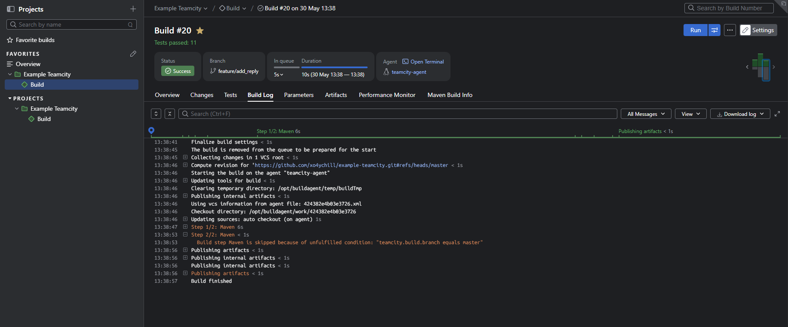
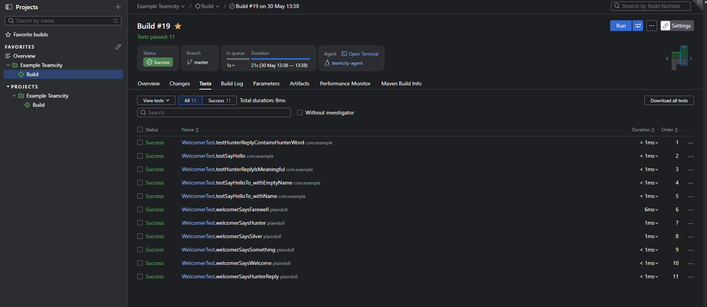
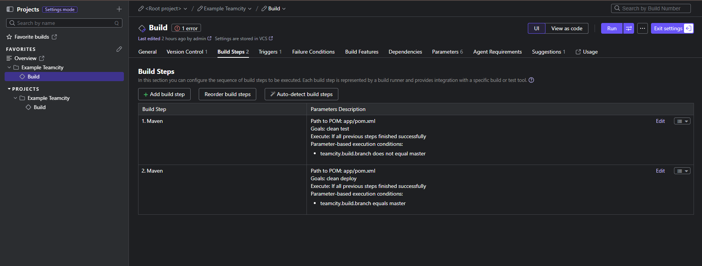
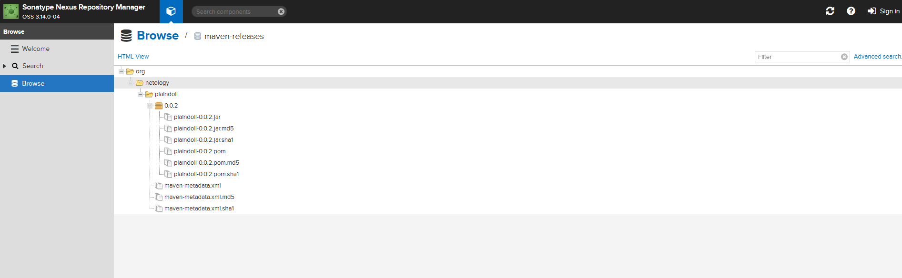
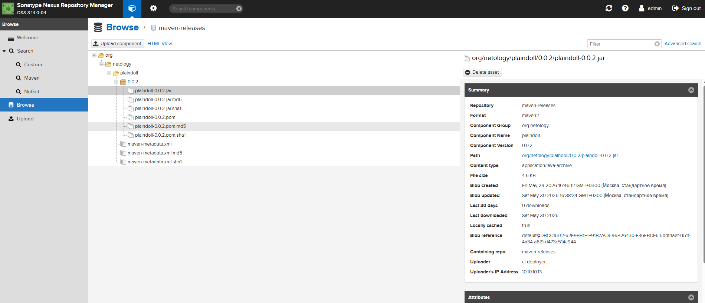

# 🎓 Домашнее задание: Настройка CI/CD в TeamCity

## 📋 Оглавление

- [🎓 Домашнее задание: Настройка CI/CD в TeamCity](#-домашнее-задание-настройка-cicd-в-teamcity)
  - [📋 Оглавление](#-оглавление)
    - [🎯 Описание](#-описание)
    - [📁 Структура проекта](#-структура-проекта)
    - [⚙️ Требования](#️-требования)
    - [🚀 Быстрый старт](#-быстрый-старт)
    - [📦 Этап 1: Подготовка окружения](#-этап-1-подготовка-окружения)
    - [🌍 Этап 2: Развёртывание инфраструктуры (Terraform)](#-этап-2-развёртывание-инфраструктуры-terraform)
    - [🐳 Этап 3: Проверка Docker-контейнеров](#-этап-3-проверка-docker-контейнеров)
    - [🔧 Этап 4: Установка Nexus через Ansible](#-этап-4-установка-nexus-через-ansible)
    - [⚙️ Этап 5: Настройка TeamCity](#️-этап-5-настройка-teamcity)
    - [🔗 Этап 6: Подключение Build Agent](#-этап-6-подключение-build-agent)
    - [📦 Этап 7: Настройка Nexus Repository](#-этап-7-настройка-nexus-repository)
    - [🔄 Этап 8: Настройка сборки в TeamCity](#-этап-8-настройка-сборки-в-teamcity)
    - [🌿 Этап 9: Работа с фича-ветками](#-этап-9-работа-с-фича-ветками)
    - [📦 Артефакты](#-артефакты)
    - [⚠️ Примечание:](#️-примечание)
    - [Скриншоты](#скриншоты)

### 🎯 Описание
Реализовать CI/CD пайплайн на базе TeamCity с использованием:

|     Компонент    |                             Требования                             |                 Реализация                |
|:----------------:|:------------------------------------------------------------------:|:-----------------------------------------:|
| TeamCity Server  | VM 4CPU/4GB, Docker-образ jetbrains/teamcity-server                | Ubuntu 22.04 + Docker + контейнер         |
| TeamCity Agent   | VM 2CPU/4GB, Docker-образ jetbrains/teamcity-agent, SERVER_URL env | Ubuntu 22.04 + Docker + -e SERVER_URL=... |
| Nexus Repository | VM 2CPU/4GB, установка через Ansible playbook                      | Ubuntu 22.04 + Ansible + Nexus 3.14.0-04  |
| Сборка проекта   | Условная логика: master→deploy, feature/*→test                     | TeamCity UI + Execution conditions        |
| Артефакты        | Публикация .jar в Nexus и в артефакты сборки                       | Maven shade plugin + artifact rules       |

### 📁 Структура проекта

```
example-teamcity/
├── README.md                          # Этот файл — документация решения
├── terraform/
│   ├── providers.tf                   # Провайдеры и настройки
│   ├── variables.tf                   # Все входные переменные
│   ├── main.tf                        # Оркестрация модулей
│   ├── outputs.tf                     # Полезные выводы
│   └── modules/
│       ├── vpc/
│       │   ├── main.tf                # Сеть VPC
│       │   ├── variables.tf           # Переменные модуля VPC
│       │   └── outputs.tf             # Выходы модуля VPC
│       ├── security/
│       │   ├── main.tf                # Security Group
│       │   ├── variables.tf           # Переменные модуля security
│       │   └── outputs.tf             # Выходы модуля security
│       └── vm/
│           ├── main.tf                # Универсальный модуль ВМ
│           ├── variables.tf           # Переменные модуля VM
│           ├── outputs.tf             # Выходы модуля VM
│           └── cloud-init-templates/
│               ├── server.tpl         # TeamCity Server в Docker
│               ├── agent.tpl          # TeamCity Agent в Docker
│               └── generic.tpl        # Базовая ВМ без Docker (для Nexus)
├── app/
│   ├── src/main/java/plaindoll/
│   │   ├── HelloPlayer.java           # Точка входа приложения
│   │   └── Welcomer.java              # Класс с методом для "hunter"
│   ├── src/test/java/plaindoll/
│   │   └── WelcomerTest.java          # Тесты JUnit
│   ├── pom.xml                        # Maven конфигурация с Nexus
│   └── teamcity/
│       └── settings.xml               # Maven credentials для Nexus
├── ansible/
│   ├── ansible.cfg                    # Настройки Ansible (фикс ACL-ошибки)
│   ├── inventory/
│   │   └── cicd/
│   │       ├── hosts.yml              # Инвентарь для Nexus VM
│   │       └── group_vars/nexus.yml   # Переменные Nexus + фикс ACL
│   ├── templates/
│   │   ├── nexus.properties.j2        # Шаблон nexus.properties
│   │   ├── nexus.systemd.j2           # Шаблон systemd-сервиса
│   │   └── nexus.vmoptions.j2         # Шаблон JVM-параметров
│   └── site.yml                       # Playbook установки Nexus
└── .teamcity/                         # Kotlin DSL (для документации)
    ├── settings.kts
    ├── pom.xml
    └── project/
        ├── Project.kt
        └── BuildType.kt
```

### ⚙️ Требования

Программное обеспечение:

|    Инструмент    |          Минимальная версия         |                                    Установка                                    |
|:----------------:|:-----------------------------------:|:-------------------------------------------------------------------------------:|
| Terraform        | ≥ 1.6.0                             | terraform.io                                                                    |
| Yandex Cloud CLI | latest                              | curl -sSL https://storage.yandexcloud.net/yandex-cloud-cli/latest/yc.sh \| bash |
| Ansible          | ≥ 2.14                              | pip install ansible или apt install ansible                                     |
| Git              | latest                              | apt install git                                                                 |
| Java             | 8 (для Nexus) / 17 (для разработки) | apt install openjdk-8-jdk-headless                                              |
| Maven            | ≥ 3.9                               | apt install maven                                                               |


### 🚀 Быстрый старт

```bash
# 1️⃣ Клонировать репозиторий
git clone https://github.com/xo4ychill/example-teamcity.git
cd example-teamcity

# 2️⃣ Настроить переменные окружения
export TF_VAR_service_account_key_file="~/.config/yandex-cloud/sa-key.json"
export TF_VAR_cloud_id="b1gxxxxxxxxxxxxxxxx"      # yc config list
export TF_VAR_folder_id="b1gxxxxxxxxxxxxxxxx"     # yc config list
export TF_VAR_ssh_public_key="$(cat ~/.ssh/id_ed25519.pub)"
export TF_VAR_allowed_ssh_cidr="YOUR.IP.ADDRESS/32"  # whatismyip.com

# 3️⃣ Развернуть инфраструктуру
cd terraform/
terraform init
terraform fmt -recursive
terraform validate          # ✅ Success!
terraform plan -out=tfplan
terraform apply tfplan

# 4️⃣ Сохранить полезные выводы
terraform output -raw teamcity_url > ~/tc-server-url.txt
terraform output -raw nexus_vm_external_ip > ~/nexus-ip.txt
terraform output -raw nexus_vm_internal_ip > ~/nexus-internal-ip.txt

# 5️⃣ Запустить Ansible для Nexus
cd ../ansible/
sed -i "s/<nexushost>/$(cat ~/nexus-ip.txt)/" inventory/cicd/hosts.yml
ansible-playbook -i inventory/cicd/hosts.yml site.yml -u yc-user --private-key ~/.ssh/id_ed25519 -v

# 6️⃣ Настроить TeamCity и проверить сборку (см. подробные этапы ниже)
```

### 📦 Этап 1: Подготовка окружения

- Установка инструментов
```bash
# Обновление системы
sudo apt update && sudo apt upgrade -y

# Установка базовых утилит
sudo apt install -y git curl wget unzip jq apt-transport-https ca-certificates

# Установка Terraform
curl -fsSL https://apt.releases.hashicorp.com/gpg | sudo gpg --dearmor -o /usr/share/keyrings/hashicorp-archive-keyring.gpg
echo "deb [signed-by=/usr/share/keyrings/hashicorp-archive-keyring.gpg] https://apt.releases.hashicorp.com $(lsb_release -cs) main" | sudo tee /etc/apt/sources.list.d/hashicorp.list
sudo apt update && sudo apt install terraform -y

# Установка Yandex Cloud CLI
curl -sSL https://storage.yandexcloud.net/yandex-cloud-cli/latest/yc.sh | bash
source ~/.bashrc  # или ~/.zshrc

# Установка Ansible
pip3 install ansible  # или: sudo apt install ansible

# Установка Java и Maven (для локальной разработки)
sudo apt install -y openjdk-17-jdk-headless maven
```
- Аутентификация в Yandex Cloud
```bash
# Получение токена (если не настроен)
yc iam create-token

# Настройка конфигурации
yc config set token <ВАШ_ТОКЕН>
yc config set cloud-id <CLOUD_ID>
yc config set folder-id <FOLDER_ID>

# Проверка доступа
yc vpc network list --folder-id $TF_VAR_folder_id
```
- Экспорт переменных для Terraform
Создайте файл ~/.teamcity-env для удобства:
```bash
# ~/.teamcity-env
export TF_VAR_service_account_key_file="$HOME/.config/yandex-cloud/sa-key.json"
export TF_VAR_cloud_id="b1gxxxxxxxxxxxxxxxx"
export TF_VAR_folder_id="b1gxxxxxxxxxxxxxxxx"
export TF_VAR_ssh_public_key="$(cat ~/.ssh/id_ed25519.pub)"
export TF_VAR_allowed_ssh_cidr="YOUR.PUBLIC.IP/32"  # Узнайте на whatismyip.com
```
Загрузите переменные:
```bash
source ~/.teamcity-env
```

### 🌍 Этап 2: Развёртывание инфраструктуры (Terraform)

```baash
cd terraform/src

# Инициализация провайдеров и модулей
terraform init

# Ожидаемый вывод:
# ✅ Terraform has been successfully initialized!

# Форматирование кода
terraform fmt -recursive

# Валидация конфигурации
terraform validate
# ✅ Ожидаемый вывод: Success! The configuration is valid.

# Создание плана с выводом в файл
terraform plan -out=tfplan

# 🔍 Внимательно проверьте план:
# • Создаются 3 ВМ с правильными характеристиками (4/2/2 CPU, 4GB RAM)
# • Создаётся сеть 10.10.10.0/24
# • Открываются порты 8111 (TeamCity) и 8081 (Nexus)
# • SSH доступен только с вашего IP (если задан allowed_ssh_cidr)

# Применение плана
terraform apply tfplan

# Подтвердите действие вводом: yes

# ⏱ Время выполнения: 5-10 минут

# Сохраните URL и IP для последующего использования
terraform output -raw teamcity_url > ~/tc-server-url.txt
terraform output -raw nexus_external_ip > ~/nexus-ip.txt
terraform output -raw nexus_internal_ip > ~/nexus-internal-ip.txt
terraform output -raw next_steps

# Пример вывода:
# teamcity_url = "http://84.201.XXX.XXX:8111"
# nexus_vm_external_ip = "84.201.YYY.YYY"
# nexus_vm_internal_ip = "10.10.10.15"
```

### 🐳 Этап 3: Проверка Docker-контейнеров

- Проверка статуса контейнеров на Server и Agent
```bash
# Проверка running-контейнеров
docker ps

# Ожидаемый вывод на server:
# CONTAINER ID   IMAGE                          STATUS    NAMES
# abc123         jetbrains/teamcity-server      Up        teamcity-server

# Ожидаемый вывод на agent:
# CONTAINER ID   IMAGE                        STATUS    NAMES  
# def456         jetbrains/teamcity-agent     Up        teamcity-agent

# На ВМ агента проверьте переменную SERVER_URL
docker exec teamcity-agent env | grep SERVER_URL

# Ожидаемый вывод:
# SERVER_URL=http://10.10.10.X:8111
# (внутренний IP сервера, не публичный!)
```

### 🔧 Этап 4: Установка Nexus через Ansible

- Подготовка inventory
```bash
# Обновите inventory с реальным внешним IP Nexus VM
cd ansible/
sed -i "s/<nexushost>/$(cat ~/nexus-ip.txt)/" inventory/cicd/hosts.yml

# Проверьте содержимое
cat inventory/cicd/hosts.yml
# nexus-01:
#   ansible_host: 84.201.YYY.YYY  # ← должен быть реальный IP
```

- Запуск playbook
```bash
# Запуск установки Nexus
ansible-playbook -i inventory/cicd/hosts.yml site.yml -u yc-user --private-key ~/.ssh/id_ed25519 -v

# Ожидаемый вывод в конце:
# PLAY RECAP *********************************************************************
# nexus-01                   : ok=XX  changed=XX  unreachable=0  failed=0  skipped=X  rescued=0  ignored=0
```

- Проверка статуса Nexus
```bash
# Проверка статуса systemd-сервиса
ssh ubuntu@$(cat ~/nexus-ip.txt) "sudo systemctl status nexus"

# Ожидаемый вывод:
# ● nexus.service - nexus service
#      Loaded: loaded (/lib/systemd/system/nexus.service; enabled)
#      Active: active (running) since ...

# Проверка доступности веб-интерфейса
curl -sf http://$(cat ~/nexus-ip.txt):8081/service/rest/v1/status && echo "✅ Nexus OK" || echo "❌ Nexus DOWN"
```

### ⚙️ Этап 5: Настройка TeamCity

- Доступ к веб-интерфейсу (данные из ```terraform output```)
```bash
http://84.201.XXX.XXX:8111
```
- Создание пользователя-администратора

### 🔗 Этап 6: Подключение Build Agent

- Проверка статуса и авторизация агента 
    - В TeamCity перейдите: Administration → Agents
    - Найдите нового агента со статусом "Unauthorized"
    - Нажмите на имя агента
    - Нажмите кнопку "Authorize" 
    - Подтвердите действие
✅ Статус изменится на "Connected"

- Проверка параметров агента
```
Агент → Parameters tab

Проверьте наличие:
• teamcity.agent.name = teamcity-agent
• env.SERVER_URL = http://10.10.10.X:8111
• teamcity.agent.jvm.os.name = Linux
```

### 📦 Этап 7: Настройка Nexus Repository

- Доступ к веб-интерфейсу Nexus
```
Откройте в браузере: http://$(cat ~/nexus-ip.txt):8081
Логин: admin
Пароль: admin123 (по умолчанию)
```
- Смена пароля администратора (ОБЯЗАТЕЛЬНО)
```
1. Нажмите на иконку пользователя (верхний правый угол)
2. Выберите "Change password"
3. Введите:
   • Current password: admin123
   • New password: ******** (новый надёжный пароль)
   • Confirm password: (повтор)
4. Нажмите "Change password"
```
- Создание пользователя для CI/CD
```
Security → Users → Create user

📝 Параметры:
• User ID: ci-deployer
• First name: CI
• Last name: Deployer  
• Email: ci@localhost
• Password: ******** (надёжный, сохраните!)
• Status: Active

✅ Нажмите "Create user"
```

- Назначение прав пользователю
```
1. Найдите пользователя ci-deployer в списке
2. Нажмите на иконку ключа (Roles)
3. Добавьте роли:

   🔹 nx-repository-view-maven2-maven-public-read
   🔹 nx-repository-view-maven2-maven-releases-edit  
   🔹 nx-repository-view-maven2-maven-snapshots-edit

✅ Нажмите "Save"
```

- Проверка Maven-репозиториев
```
Repository → Repositories

✅ Должны присутствовать:
• maven-public (group)
• maven-releases (hosted) — для release-версий
• maven-snapshots (hosted) — для SNAPSHOT-версий
• maven-central (proxy)
```

### 🔄 Этап 8: Настройка сборки в TeamCity

- Импорт проекта из репозитория
```
1. На главной странице нажмите "Create Project"
2. Выберите "From URL"
3. Заполните форму:

   🔗 VCS root URL: https://github.com/your-username/example-teamcity
   🔐 Authentication method: Public (для публичного) или Username/Password
   📁 Default branch: refs/heads/master

4. Нажмите "Proceed"
```

- Autodetect конфигурации
```
1. На экране "Build Configuration" TeamCity автоматически определит:
   • Build runner: Maven
   • pom.xml location: ./pom.xml
   • Goals: clean package

2. Проверьте автоопределённые параметры
3. Нажмите "Save"
```

- Настройка параметров проекта
```
Project Settings → Parameters → Add parameter

📝 Параметр 1:
• Name: nexus.url
• Value: 10.10.10.15:8081  # ← внутренний IP из terraform output
• Type: Text

📝 Параметр 2:  
• Name: nexus.user
• Value: ci-deployer
• Type: Text

📝 Параметр 3:
• Name: nexus.password
• Value: ******** (пароль пользователя ci-deployer)
• Type: 🔒 Password (обязательно!)

✅ Нажмите "Save" после каждого параметра
```

- Настройка шагов сборки с условиями
```
Перейдите: Build Configuration → Build Steps

 Шаг 1: Тесты (для всех веток, кроме master):
 📝 Параметры шага:
• Run: Maven
• Goals: clean test
• POM file path: pom.xml
• User settings file: teamcity/settings.xml
• Maven version: default

🔹 Условия выполнения (Execution conditions):
• Add condition → Equals
• Parameter: teamcity.build.branch
• Value: master
• ☑️ Invert condition (выполнять если НЕ равно master)

✅ Нажмите "Save"

Шаг 2: Деплой (только для master):

📝 Параметры шага:
• Run: Maven  
• Goals: clean deploy
• POM file path: pom.xml
• User settings file: teamcity/settings.xml
• Maven version: default

🔹 Условия выполнения:
• Add condition → Equals
• Parameter: teamcity.build.branch
• Value: master
• ☐ Invert condition (выполнять только если равно master)

✅ Нажмите "Save"
```

- Настройка артефактов
```
Build Configuration → General Settings → Artifact paths

📝 Правило:
+:target/plaindoll-*.jar => artifacts/

✅ Нажмите "Save"
```

- Настройка триггера
```
Build Configuration → Triggers → Add trigger → VCS Trigger

📝 Параметры:
• Branch filter: +:*

✅ Нажмите "Save"
```

### 🌿 Этап 9: Работа с фича-ветками

- Создание ветки feature/add_reply
```bash
# Локально в клоне репозитория
git checkout -b feature/add_reply

# Проверка текущей ветки
git branch
# * feature/add_reply
#   master
```

- Добавление метода sayHunterReply()
Откройте app/src/main/java/plaindoll/Welcomer.java и добавьте:
```java
/**
 * ✅ НОВЫЙ МЕТОД: добавлен в ветке feature/add_reply
 * Требование: вернуть строку, содержащую слово "hunter"
 */
public String sayHunterReply() {
    return "Greetings, brave hunter! Your quest awaits in the northern woods.";
}
```

- Добавление теста
Откройте app/src/test/java/plaindoll/WelcomerTest.java и добавьте:
```java
/**
 * ✅ НОВЫЙ ТЕСТ: проверка метода sayHunterReply()
 * Требование: реплика должна содержать слово "hunter"
 */
@Test
public void welcomerSaysHunterReply() {
    String reply = welcomer.sayHunterReply();
    assertNotNull("Reply must not be null", reply);
    // Регистронезависимая проверка по заданию
    assertThat("Reply should contain 'hunter' (case-insensitive)", 
              reply.toLowerCase(), containsString("hunter"));
}
```
- Локальная проверка
```bash
# Запуск тестов локально
mvn clean test

# ✅ Ожидаемый вывод:
# [INFO] Tests run: 6, Failures: 0, Errors: 0, Skipped: 0
# [INFO] BUILD SUCCESS
```

### 📦 Артефакты
- Nexus: http://Y.Y.Y.Y:8081/#browse/browse:maven-releases:org/netology/plaindoll
- [Artifacts](artifacts)

### ⚠️ Примечание:
```
Конфигурация TeamCity выполнена через веб-интерфейс из-за блокировки
репозитория JetBrains (HTTP 451) из региона Yandex Cloud.
Файлы .teamcity/ предоставлены для справки.
```

### Скриншоты





